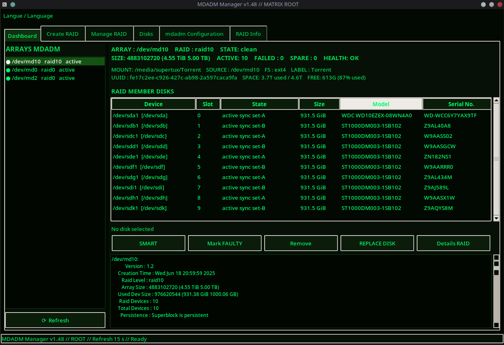
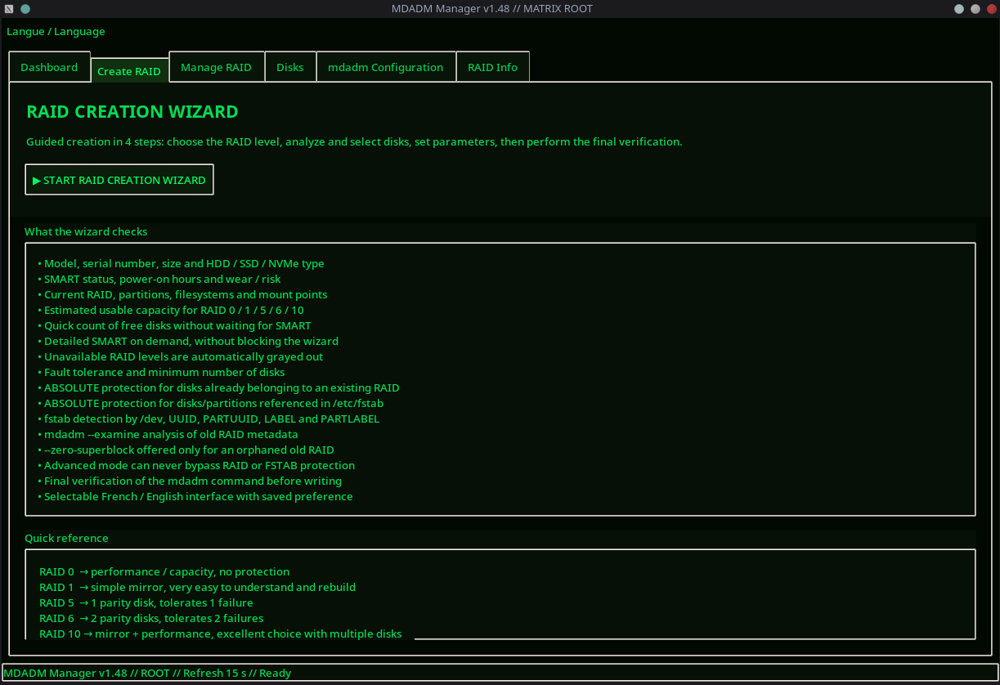
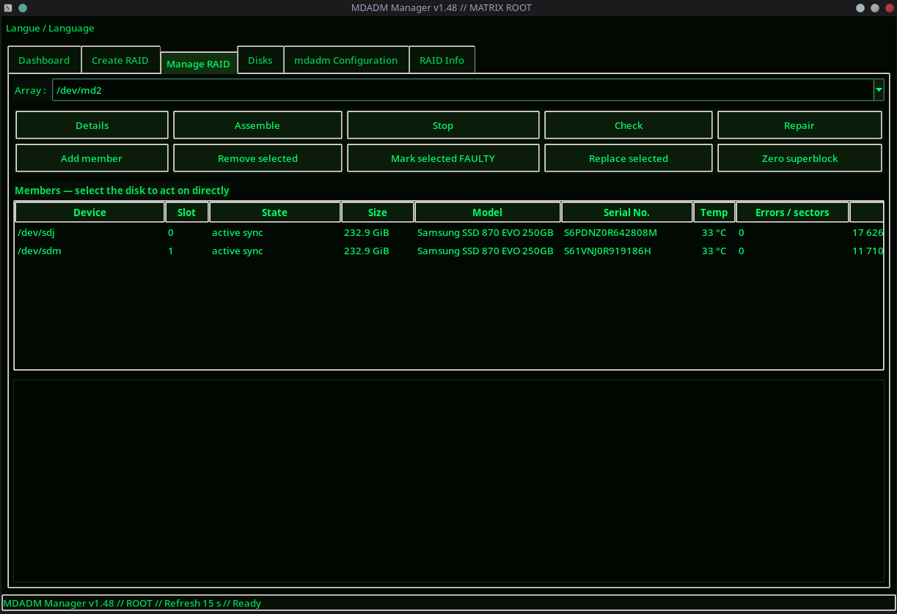
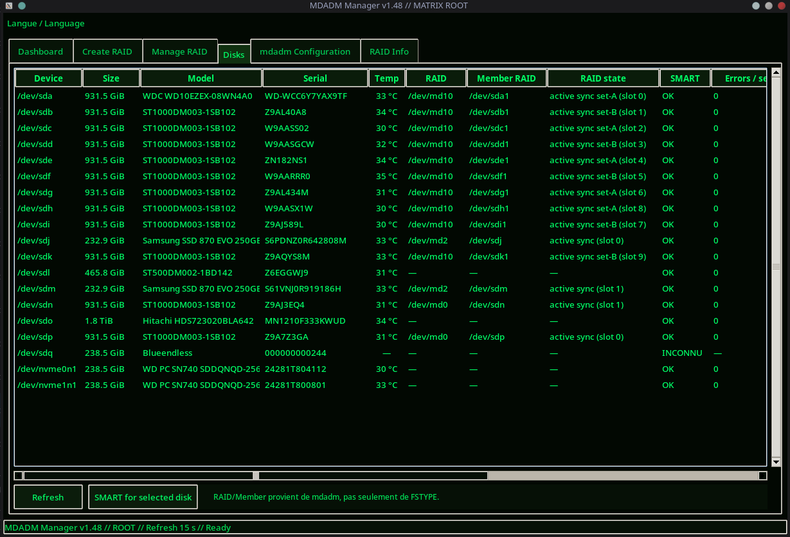
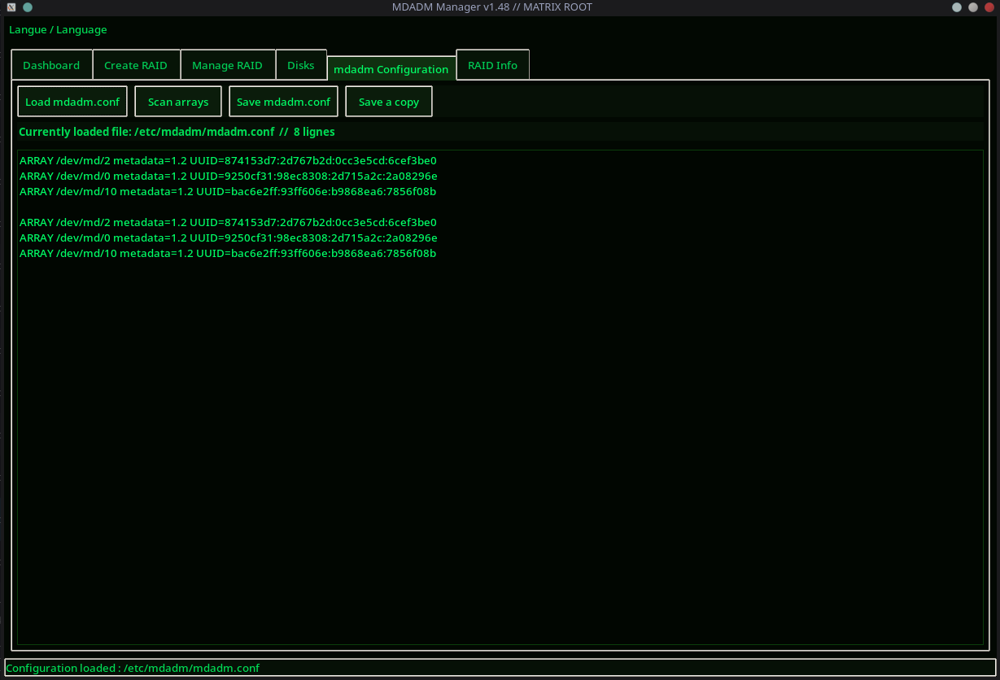
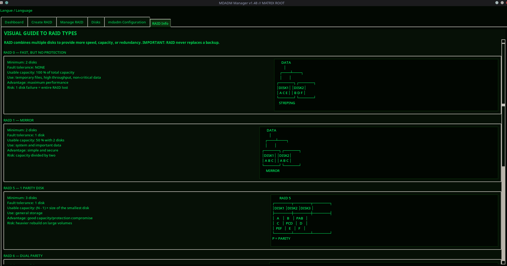

# MDADM Manager

**MDADM Manager** is a graphical RAID management and monitoring application for Linux built around `mdadm`.

It provides a Matrix-style graphical interface for RAID creation, monitoring, disk health inspection, SMART diagnostics, and common RAID maintenance tasks.

> ⚠️ **RELEASE CANDIDATE / BETA SOFTWARE**
>
> This project performs privileged disk and RAID operations. Always keep verified backups of important data and carefully review operations before confirming destructive actions.

---

## Current Version

### **v1.48 RC1**

**Release Candidate — Final testing phase**

MDADM Manager v1.48 RC1 represents a major evolution of the project since the original public beta v1.29.

The application is now close to feature-complete, but additional testing is still required before v1.48 is declared stable.

---

## Screenshots

### Dashboard



Monitor mdadm arrays, RAID state, capacity, mounted filesystems, member disks, SMART information, and maintenance actions from the main dashboard.

### Create RAID Wizard



Guided RAID creation with RAID-level explanations, disk analysis, SMART checks, safety protections, capacity estimates, and final command verification.

### Manage RAID



Manage existing arrays and their members, including array details, assemble/stop/check/repair operations, member replacement and removal, SMART information, disk errors, usage, and temperature.

### Disks & SMART Monitoring



View physical disks, model and serial information, temperatures, RAID membership, RAID state, SMART health, error indicators, and disk usage information in one place.

### mdadm Configuration



Load, inspect, scan, save, and back up the system `mdadm.conf` configuration directly from the graphical interface.

### RAID Information



Built-in visual reference for RAID 0, RAID 1, RAID 5, RAID 6, RAID 10 and other supported RAID concepts, including minimum disks, fault tolerance, usable capacity, advantages, and risks.

## Main Features

- Graphical management of Linux `mdadm` RAID arrays
- RAID creation wizard
- RAID member detection and status display
- Disk and RAID health monitoring
- SMART monitoring for HDD, SATA SSD, and NVMe drives
- Disk temperature display
- SMART error and sector monitoring
- HDD statistical risk indicator
- SSD/NVMe wear and endurance information
- TB written calculation when supported
- RAID member safety checks
- `/etc/fstab` protection checks
- RAID superblock protection checks
- French / English interface
- Progressive startup for faster GUI display
- Background SMART scanning
- Matrix-style black and green interface
- Beginner-friendly bilingual source-code comments

---

## Major Improvements Since v1.29

### Code organization

The source code has been reorganized into clear logical sections:

1. Internationalization / translations
2. System commands and privileges
3. RAID and device detection
4. SMART and disk health
5. RAID, FSTAB, and superblock safety
6. GUI infrastructure
7. RAID creation wizard
8. Main application
9. Startup and dependency handling

Extensive beginner-friendly comments were also added throughout the code.

---

## French / English Support

The application now includes expanded bilingual support.

Improvements include:

- French and English interface
- RAID creation wizard translation
- RAID management translation
- SMART diagnostic translation
- Dynamic language switching
- Language menu
- Bilingual beginner-friendly comments in the source code

---

## Startup and Performance

Startup behavior has been significantly improved.

The application now:

- Displays the main interface before long SMART operations finish
- Performs SMART scans in the background
- Uses non-blocking disk refresh operations
- Loads tabs progressively
- Prioritizes a tab when the user selects it before background loading is complete
- Reduces startup delays on systems with many disks

Several startup crashes caused by widgets being accessed before initialization were also corrected.

---

## Matrix Interface Improvements

The interface has received several visual improvements:

- Consistent black background
- Green Matrix-style text
- Improved Listbox appearance
- Improved Text and Entry widgets
- Matrix-style Combobox controls
- Improved RAID selection readability
- Removal of white areas during progressive startup
- More consistent visual behavior between tabs

---

## SMART Monitoring

SMART support has been greatly expanded.

### HDD

Available information may include:

- SMART health
- Temperature
- Minimum / maximum temperature when reported
- Power-on hours
- Power cycles
- Start / stop cycles
- Load / unload cycles
- Reallocated sectors
- Pending sectors
- Offline uncorrectable sectors
- Reported uncorrectable errors
- Spin retry count
- Command timeouts
- UDMA CRC errors
- Total LBAs written
- Total LBAs read
- Actual TB written when the drive exposes the required SMART attribute
- Statistical HDD risk index

The HDD risk value is a **monitoring indicator**, not an estimate of remaining drive life.

### SATA SSD

Additional SSD information may include:

- SSD wear
- Remaining life attributes
- TB written
- Manufacturer TBW rating when known
- TBW used percentage
- TBW remaining percentage

Samsung 870 EVO endurance ratings are supported for known capacities.

### NVMe

NVMe monitoring may include:

- Percentage Used
- Media and Data Integrity Errors
- Power-on hours
- Power cycles
- Data Units Written
- Estimated TB written
- Temperature
- SMART health

---

## Disk Temperature Integration

A compact **Temp** column has been added to the main disk views.

Temperature is now displayed in:

- Dashboard RAID member view
- Manage RAID
- Disks tab
- Create RAID disk selection

Example:

```text
31 °C
```

If a drive does not report temperature, the interface displays:

```text
—
```

---

## RAID Creation Wizard

The RAID creation wizard includes:

- RAID level selection
- Minimum disk requirements
- Fault-tolerance information
- RAID level explanations
- Configuration validation
- Disk selection
- SMART information
- Disk temperature
- Progress information
- Safety checks before creation

---

## RAID Management

MDADM Manager provides graphical access to RAID information and maintenance operations.

Current features include:

- RAID array detection
- RAID member display
- Member state information
- Physical disk information
- SMART information for RAID members
- Disk error indicators
- Usage information
- Temperature monitoring
- RAID safety checks

Because RAID operations can be destructive, the application performs additional validation before sensitive actions.

---

## Safety Features

MDADM Manager includes checks intended to reduce accidental data loss.

These include:

- Detection of disks already used by RAID
- RAID member protection
- Filesystem checks
- Mounted filesystem detection
- `/etc/fstab` checks
- mdadm superblock checks
- Confirmation before destructive operations

These protections do **not** replace verified backups.

---

## Requirements

MDADM Manager is designed primarily for Linux systems using `mdadm`.

Typical requirements include:

```text
Python 3
python3-tk
mdadm
smartmontools
lsblk
util-linux
```

Depending on the distribution and desktop environment, privilege escalation may use tools such as:

```text
pkexec
kdesu
```

---

## Running MDADM Manager

Make the script executable:

```bash
chmod +x mdadm_manager_v1.48.py
```

Then run it:

```bash
python3 mdadm_manager_v1.48.py
```

The application may request administrative privileges because RAID and SMART operations often require root access.

---

## Current Testing Status

v1.48 RC1 is **almost complete** and is currently in final testing.

Areas that still require additional real-world testing include:

- HDD SMART monitoring
- SATA SSD SMART monitoring
- NVMe SMART monitoring
- Disk temperature reporting
- RAID creation
- RAID member removal and replacement
- Faulty disk operations
- RAID protection checks
- `/etc/fstab` protection
- Background SMART refresh
- French / English switching
- Progressive startup
- Different RAID levels
- Systems with many disks
- Different Debian / Linux configurations
- Different screen resolutions

---

## Release Status

**Current release: v1.48 RC1**

This version is published as a **pre-release / release candidate**.

Once final testing is complete, it will become:

### **MDADM Manager v1.48 Stable**

---

## Development

MDADM Manager is actively developed and tested on Linux.

Bug reports, testing feedback, and contributions are welcome.

If you test this release, useful feedback includes:

- Linux distribution and version
- Kernel version
- RAID level
- Number and type of disks
- HDD / SSD / NVMe models
- Error message or traceback
- Screenshot when relevant
- Steps required to reproduce the problem

---

## Disclaimer

MDADM Manager performs operations on physical disks and RAID arrays.

Incorrect RAID operations can cause permanent data loss.

Use this software at your own risk and always maintain verified backups of important data.
