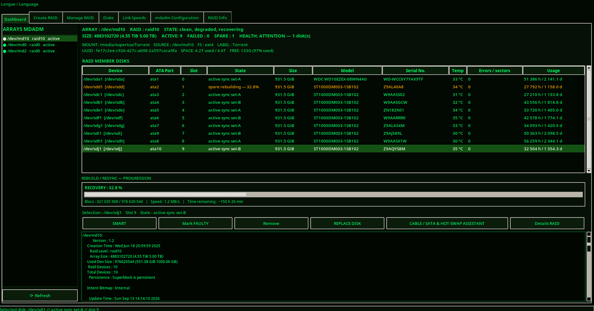
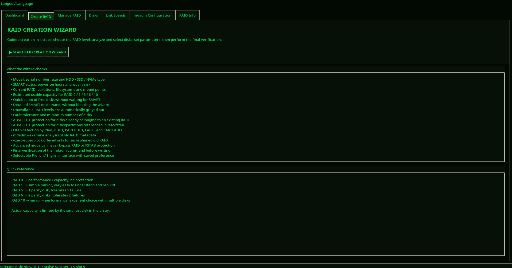
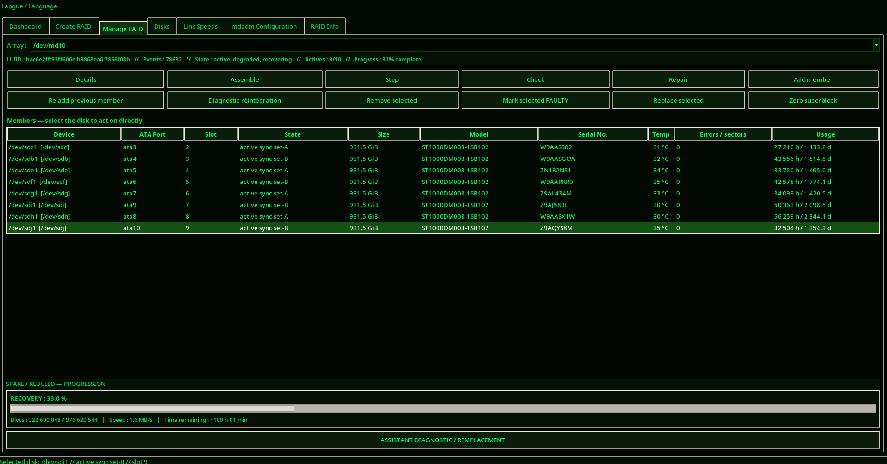
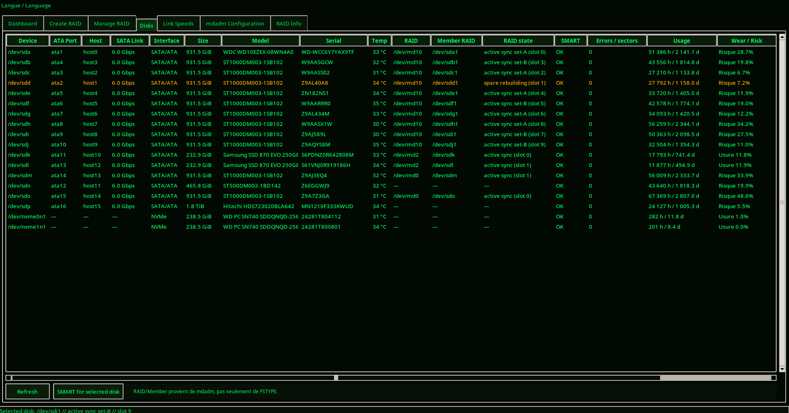
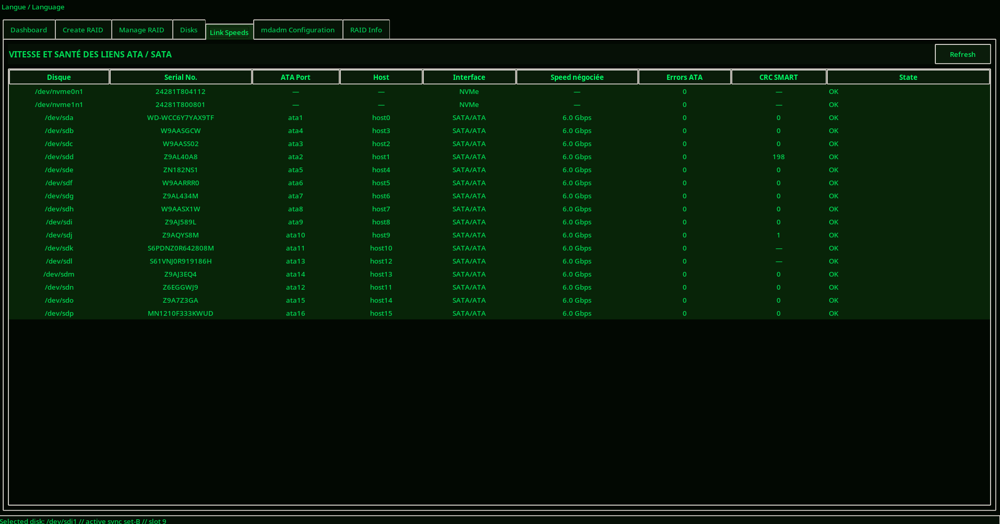
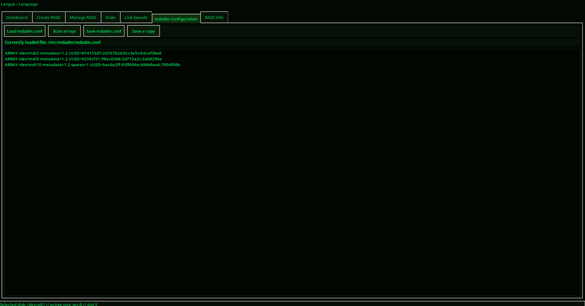

# MDADM Manager

**MDADM Manager** is a graphical RAID management and monitoring application for Linux built around `mdadm`.

> ⚠️ **BETA SOFTWARE** — RAID operations can cause permanent data loss. Keep verified backups and review every destructive action before confirming it.

---

## Current Version

### **v1.75 FULL / MODULAR**

The v1.75 FULL build remains the complete reference engine while the official modular launcher now runs through `mdadm_matrix/`. This keeps every v1.75 feature available while the code is progressively separated into maintainable modules.

Official modular launcher:

```text
mdadm_manager_v1.75.py
```

Complete v1.75 reference engine:

```text
mdadm_manager_v1.75_full.py
```

The full version history is preserved in [`CHANGELOG.md`](CHANGELOG.md).

---

## Screenshots













---

## Main features

- RAID array detection and monitoring;
- member status and slot tracking;
- SMART disk information and diagnostics;
- CRC monitoring and maintenance assistance;
- guided disk replacement workflows;
- previous RAID member reintegration with Array UUID validation;
- live rebuild / recovery / resync / reshape progress;
- RAID creation and management tools;
- filesystem, mount and `/etc/fstab` safety checks;
- confirmation dialogs before sensitive operations;
- modular `mdadm_matrix` architecture;
- Debian / Ubuntu support;
- `uv` and system Python launch methods.

---

## Modular architecture

```text
mdadm_manager_v1.75.py        # official launcher
mdadm_manager_v1.75_full.py   # complete v1.75 reference engine
mdadm_matrix/
├── __init__.py
├── __main__.py
├── main.py
├── full_engine.py
├── app.py
├── assistant.py
├── core.py
├── crc_assistant.py
├── crc_monitor.py
├── gui_common.py
├── i18n.py
├── rebuild_monitor.py
├── rebuild_ui.py
├── replacement.py
├── system.py
└── wizard.py
```

`full_engine.py` provides a compatibility bridge to the complete v1.75 engine. This prevents functions added after the older modular build from being lost during the refactor. Components can then be migrated module by module without changing user-visible behavior.

---

## Installation

### Debian / Ubuntu

```bash
sudo apt update
sudo apt install -y python3 python3-tk mdadm smartmontools util-linux git curl
```

For KDE Plasma:

```bash
sudo apt install -y kde-cli-tools
```

Clone the repository:

```bash
git clone https://github.com/st3ph666/MDADM-Manager.git
cd MDADM-Manager
```

### Run with uv

```bash
uv sync
uv run python mdadm_manager_v1.75.py
```

Or launch the package directly:

```bash
uv run python -m mdadm_matrix
```

### Run with system Python

```bash
python3 mdadm_manager_v1.75.py
```

### Update an existing installation

```bash
git pull
uv sync
uv run python mdadm_manager_v1.75.py
```

---

## Version history

The repository keeps only the current active launcher, but release history is preserved in [`CHANGELOG.md`](CHANGELOG.md). Known published milestones include v1.29, v1.48 RC1, v1.49, v1.56, v1.58, v1.59, v1.60, v1.61 and v1.75 FULL. Intermediate v1.62-v1.74 builds are identified as development builds when no separate release record exists in Git history.

---

## Safety

MDADM Manager includes RAID membership checks, filesystem and mount checks, `/etc/fstab` protections, mdadm superblock checks, and confirmation dialogs before sensitive operations. These protections do not replace verified backups.

**Current release: v1.75 FULL / MODULAR**
